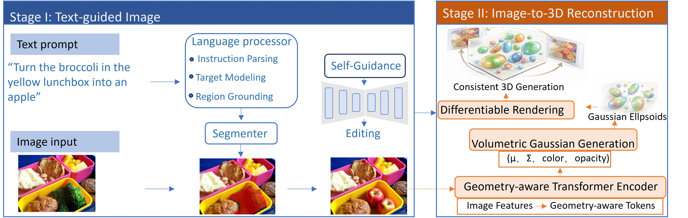
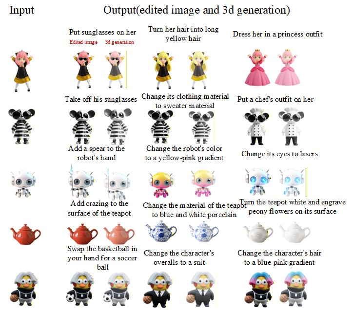

<h1 align="center">Say and Edit: Text-Guided 3D Editing With Automatic Mask and Self-Guidance</h1>

<h2 align="center">Abstract</h2>

<p align="justify">
Text-guided 3D object editing remains challenging due to inaccurate local region localization, insufficient semantic control, and difficulty in maintaining 3D consistency. To address these issues, we propose a diffusion-based two-stage editing framework that decomposes the text-driven 3D editing task into (1) text-guided image editing and (2) image-to-3D reconstruction, enabling stable and high-quality 3D editing results. In the first stage, we perform instruction-aware image editing by decomposing the editing instruction into fine-grained semantic targets, generating accurate editing masks via cross-modal matching, and introducing a self-guidance mechanism to strengthen the semantic direction of the diffusion process, thereby achieving high-precision local editing while preserving structural consistency. In the second stage, we reconstruct a consistent 3D model from the edited image using a volumetric Gaussian representation, where Gaussian primitives are optimized in both geometry and appearance through geometric priors and differentiable rendering, ensuring stable shape and fine details across views. Experimental comparisons with strong baselines such as LRM and InstructPix2Pix (IP2P) demonstrate that our method achieves higher semantic alignment in image editing (CLIP-Score 26.32) with lower perceptual error (LPIPS 0.22) while reducing editing time to 7 seconds. For 3D reconstruction, our approach reaches PSNR 20.04, SSIM 0.785, and reduces FID to 26.38, outperforming existing baselines overall.
</p>
<h2 align="center">Overall Working Framework</h2>

<p align="justify">
The overall framework of our proposed two-stage text-guided 3D object editing method is illustrated in <b>Figure 1</b>.
Given a natural language editing instruction as input, the pipeline consists of four core modules executed sequentially.
First, the <b>Language Processor</b> performs semantic parsing and decomposition of the instruction, producing structured editing targets
and region-related semantic signals. Second, the <b>Segmenter</b> leverages these semantic cues to precisely localize the editable region in the input image
and generates a pixel-level mask. Third, within the editing framework, the diffusion model is guided by both the mask and semantic signals,
while a <b>Self-Guidance</b> mechanism strengthens the intended semantic direction to achieve high-quality localized image editing.
Finally, the <b>3D Generation</b> module reconstructs a consistent 3D object from the edited single-view image using a <b>Volumetric Gaussian Representation</b>
and a <b>Geometry-aware Transformer</b>, producing a coherent 3D model that can be rendered from multiple viewpoints.
By clearly separating the pipeline into image editing and 3D reconstruction stages, our method improves both semantic accuracy and 3D consistency,
while significantly enhancing overall efficiency.
</p>

<p align="center">
  
</p>

<p align="center">
  <i>Overview of the proposed two-stage text-guided 3D object editing framework.</i>
</p>
## Install

Install packages in `requirements.txt`.  
We trained the model on a single RTX 4090 GPU with CUDA, and we recommend using a Linux server for reproduction.

```bash
conda create -n <environment name>
conda activate <environment name>
pip install -r requirements.txt
```
## Install taming-transformers

```bash
pip install git+https://github.com/CompVis/taming-transformers
```
## RUN

1. Text-guided image editing

```bash
python edit.py --input imgs/ice.png --output imgs/iceout.png --edit "Turn it into a double ice cream"
```
2  3D generation

```bash
python pzh_gradio.py
```
## Results
<p align="center">
  
</p>
